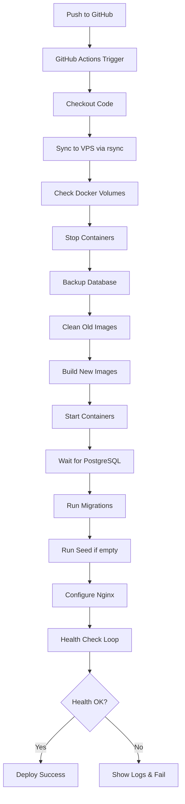

# 🔧 Configuração de Deploy - FuseLink

## 📝 Resumo das Alterações

Adaptei o arquivo de deploy da aplicação Advocacia Pitanga para o FuseLink com as seguintes configurações:

### ✅ Configurações Aplicadas

| Item | Valor |
|------|-------|
| **Porta Externa** | 3200 |
| **Domínios** | fuselink.com.br<br>www.fuselink.com.br |
| **VPS IP** | 72.60.10.112 |
| **Secret GitHub** | VPS_PASSWORD (mesma já configurada) |
| **Diretório VPS** | /root/fuselink |
| **Banco de Dados** | PostgreSQL 16 |
| **Usuario DB** | fuselink |
| **Nome DB** | fuselink |

## 📂 Arquivos Modificados/Criados

### 1. `.github/workflows/deploy-vps.yml` ✅
**Criado:** Workflow completo de deploy automático

**Features:**
- ✅ Sync código via rsync
- ✅ Proteção de volumes Docker
- ✅ Build de imagens sem cache
- ✅ Backup automático antes de migrations
- ✅ Execução de migrations do Prisma
- ✅ Seed automático (se banco vazio)
- ✅ Configuração automática do Nginx
- ✅ Health checks
- ✅ Logs de diagnóstico
- ✅ Verificação de deployment

### 2. `docker-compose.yml` ✅
**Modificado:** Porta externa alterada

```yaml
# Antes
EXTERNAL_PORT=8080

# Depois
EXTERNAL_PORT=3200
```

### 3. `.env.example` ✅
**Modificado:** URLs e porta atualizadas

```env
# Antes
EXTERNAL_PORT=8080
NEXT_PUBLIC_API_URL=http://localhost:8080/api
NEXTAUTH_URL=http://localhost:3000

# Depois
EXTERNAL_PORT=3200
NEXT_PUBLIC_API_URL=http://localhost:3200/api
NEXTAUTH_URL=http://localhost:3200
```

### 4. `DEPLOY.md` ✅
**Criado:** Guia completo de deploy com:
- Configuração inicial
- Deploy automático
- Configuração SSL
- Comandos úteis
- Troubleshooting
- Checklist completo

## 🔄 Diferenças da Aplicação Original

| Aspecto | Advocacia Pitanga | FuseLink |
|---------|-------------------|----------|
| **Porta** | 3190 | **3200** |
| **Domínio** | advocaciapitanga.com.br | **fuselink.com.br** |
| **Diretório** | /root/advocaciapitanga | **/root/fuselink** |
| **Containers** | advocacia-vps, advocacia-postgres | **fuselink-web, fuselink-api, fuselink-postgres, fuselink-nginx** |
| **Arquitetura** | Monolítico | **Microserviços (frontend + backend + nginx)** |
| **Framework Frontend** | Next.js embarcado | **Next.js standalone** |
| **Backend** | Node.js/Express | **Node.js/Express + Prisma** |
| **Database** | PostgreSQL | **PostgreSQL 16** |
| **Volumes** | postgres_data | **postgres_data + uploads** |

## 🏗️ Arquitetura do Deploy

```
┌─────────────────────────────────────────┐
│          Internet (porta 80/443)        │
└─────────────────┬───────────────────────┘
                  │
┌─────────────────▼───────────────────────┐
│  Nginx (Host) - Reverse Proxy           │
│  - Porta 80/443 → 3200                  │
│  - SSL/TLS (certbot)                    │
│  - fuselink.com.br                      │
│  - www.fuselink.com.br                  │
└─────────────────┬───────────────────────┘
                  │
┌─────────────────▼───────────────────────┐
│  Docker Network (fuselink-network)      │
│                                         │
│  ┌─────────────────────────────────┐   │
│  │  fuselink-nginx (porta 3200)    │   │
│  │  - Roteamento interno           │   │
│  └──────────┬──────────────────────┘   │
│             │                           │
│  ┌──────────▼──────────┬───────────┐   │
│  │                     │           │   │
│  │  fuselink-web       │  fuselink-│   │
│  │  (Next.js)          │  api      │   │
│  │  porta 3000         │  (Express)│   │
│  │                     │  porta    │   │
│  │                     │  3001     │   │
│  └─────────────────────┴─────┬─────┘   │
│                              │         │
│  ┌───────────────────────────▼─────┐   │
│  │  fuselink-postgres              │   │
│  │  PostgreSQL 16                  │   │
│  │  porta 5432                     │   │
│  │  Volume: postgres_data          │   │
│  └─────────────────────────────────┘   │
└─────────────────────────────────────────┘
```

## 🔐 Segurança

### Proteção de Dados Implementada

1. **Volumes Persistentes:**
   - ✅ Nunca usa `docker-compose down -v`
   - ✅ Backup automático antes de migrations
   - ✅ Verificação de integridade de volumes
   - ✅ Rollback automático em caso de falha

2. **Secrets e Passwords:**
   - ✅ Senhas geradas com OpenSSL
   - ✅ JWT secrets únicos
   - ✅ Variáveis de ambiente isoladas
   - ✅ .env não commitado

3. **Network Security:**
   - ✅ Containers em rede isolada
   - ✅ Apenas Nginx exposto externamente
   - ✅ PostgreSQL não acessível externamente
   - ✅ CORS configurado

## 📊 Monitoramento e Logs

### Logs Disponíveis

```bash
# Nginx Host
/var/log/nginx/fuselink-access.log
/var/log/nginx/fuselink-error.log

# Containers Docker
docker logs fuselink-web
docker logs fuselink-api
docker logs fuselink-postgres
docker logs fuselink-nginx
```

### Health Checks

```bash
# Aplicação
curl http://localhost:3200/health

# API
curl http://localhost:3200/api/health

# PostgreSQL
docker exec fuselink-postgres pg_isready -U fuselink
```

## 🚀 Pipeline de Deploy



## 📋 Variáveis de Ambiente (Produção)

```env
# Docker
EXTERNAL_PORT=3200

# Database
POSTGRES_DB=fuselink
POSTGRES_USER=fuselink
POSTGRES_PASSWORD=<gerada-automaticamente>
DATABASE_URL=postgresql://fuselink:<password>@postgres:5432/fuselink

# JWT
JWT_SECRET=<gerado-automaticamente>
JWT_EXPIRES_IN=7d

# Frontend
NEXT_PUBLIC_API_URL=https://fuselink.com.br/api
NEXTAUTH_SECRET=<gerado-automaticamente>
NEXTAUTH_URL=https://fuselink.com.br

# Node
NODE_ENV=production

# CORS
CORS_ORIGIN=https://fuselink.com.br,https://www.fuselink.com.br

# Upload
MAX_FILE_SIZE=10485760
UPLOAD_DIR=/app/uploads

# Rate Limiting
RATE_LIMIT_WINDOW_MS=900000
RATE_LIMIT_MAX_REQUESTS=100
```

## ✅ Checklist Pré-Deploy

- [ ] DNS configurado (A records para 72.60.10.112)
- [ ] Docker instalado na VPS
- [ ] Docker Compose instalado
- [ ] Secret VPS_PASSWORD no GitHub
- [ ] Nginx instalado no host
- [ ] Certbot instalado (para SSL)
- [ ] Porta 3200 liberada no firewall (se houver)
- [ ] Portas 80 e 443 liberadas

## 🎯 Próximos Passos Após Deploy

1. **Verificar containers rodando:**
   ```bash
   docker-compose ps
   ```

2. **Configurar SSL:**
   ```bash
   certbot --nginx -d fuselink.com.br -d www.fuselink.com.br
   ```

3. **Testar acesso:**
   - https://fuselink.com.br
   - https://www.fuselink.com.br

4. **Criar primeiro usuário ou usar demo:**
   - Email: demo@fuselink.com
   - Senha: password123

5. **Monitorar logs:**
   ```bash
   docker-compose logs -f
   ```

## 📞 Troubleshooting Rápido

| Problema | Solução |
|----------|---------|
| Containers não iniciam | `docker-compose logs` |
| Health check falha | Verificar logs API e Web |
| Nginx erro 502 | Containers estão rodando? |
| Banco não conecta | Verificar DATABASE_URL |
| SSL não funciona | Executar certbot |
| Porta não acessível | Verificar firewall/ufw |

---

**Configuração adaptada com sucesso para FuseLink! 🚀**

**Porta:** 3200 | **Domínios:** fuselink.com.br, www.fuselink.com.br | **VPS:** 72.60.10.112
